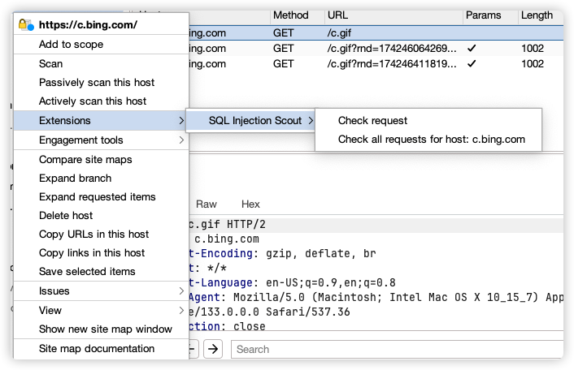
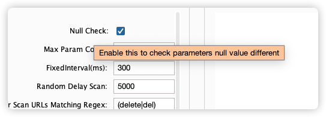

# 更新日志

## 2.0 😌
- 优化 UI 界面布局，提升操作体验
- 新增`Nested JSON Key`功能，支持自定义参数名称扫描嵌套 JSON 格式内容（示例：`{"a":"{\"b\":\"1\"}"}`），嵌套参数以`parm_a->name`形式展示
- 新增配置导出 / 导入功能，支持规则快速迁移复用
- 新增批量发送能力，可在 `History/Logger/Intruder `界面多选日志条目，一键批量发送至扫描器进行检测
- 调整部分代码逻辑

## 1.0.9
- 增加`Ignore Params`功能跳过对指定参数的扫描
- 内置了一些隐藏参数
- 修复JSON TYPE错误处理导致遗漏参数问题

## 1.0.8
  - 优化颜色标记与颜色/主表格排序错乱与2次生效问题 
  - 取消response长度相同但是内容不同的标记

## 1.0.7
- 添加`Delete item` 选项，可删除单条日志。
- 在`Site map`/`HTTP history`/`Logger`面板添加右键菜单，支持检测站点**单个**与**所有**请求
  - （搭配[CaA](https://github.com/gh0stkey/CaA)使用本插件的`Fuzz Params List`功能）

- 优化一些多线程逻辑
- 删除`×`标记

## 1.0.6
- 默认优先显色排序，每次点击新的主面板新的条目后，副面板排序条件重置
- 优化一些判断逻辑
- 对`Never Scan URLs Matching Regex`命中进行`Flag`提示

## 1.0.5
- 添加日志表格排序
- 简化`Flag`提示内容，有趣使用`√`否则为`×`
- 支持用户在`Fuzz Params List`列表中 ( 一行一个参数) 自定义原请求参数，用于`Fuzz`隐藏参数。

## 1.0.4
- 添加`Boring Words`配置，支持用户自定义过滤无趣的响应内容
- 结果排序更改，优先按照参数名称进行排序
- 对于内置的`'''`和`''''`，`#{}`和`#}`单独计算颜色
- 删除了大部分`payload`

## 1.0.3
- 将大于`Max Param Count`的请求加入日志列表，并使用`ExcessParams`标记
- 对`null`扫描添加逻辑，忽略`302`状态码时依然为`interesting`
- 对`302`进行扫描
- 修改了内置一些`payload`

## 1.0.2 2025年 1月16日
- 修复一直处于`scanning`扫描状态[#3 ](https://github.com/JaveleyQAQ/SQL-Injection-Scout/issues/5)

## 1.0.1 2025年 1月15日 
* 配置持久化
* 添加新的`payload`，顺便检测越权
  * 单个参数设置为`null`
  * 将所有参数同时设置为`null`，参数名包含`page`、`size`、`limit`、`count`、`num`除外
  * JSON 设置为`{ }`
* 针对值为`int`类型且不被引号包裹做处理，仅使用`-1`与`null`扫描
* 对每个设置标签添加鼠标停留提示文本

  * 添加新的规则标识
    * 黄色
    * diff 字段 为 `same`，但是文本细节不同时的处理。
    * 例子:
  >   原始
    >   >   {"count": 0, "data":{ }}
    > 
    >   修改后
    > 
    >   >   {"count": 1, "data":{ }}  

## 1.0.0 发布
* 🔥 芜湖～ 1️⃣ giao我里giao giao！ 呀呼～
  
