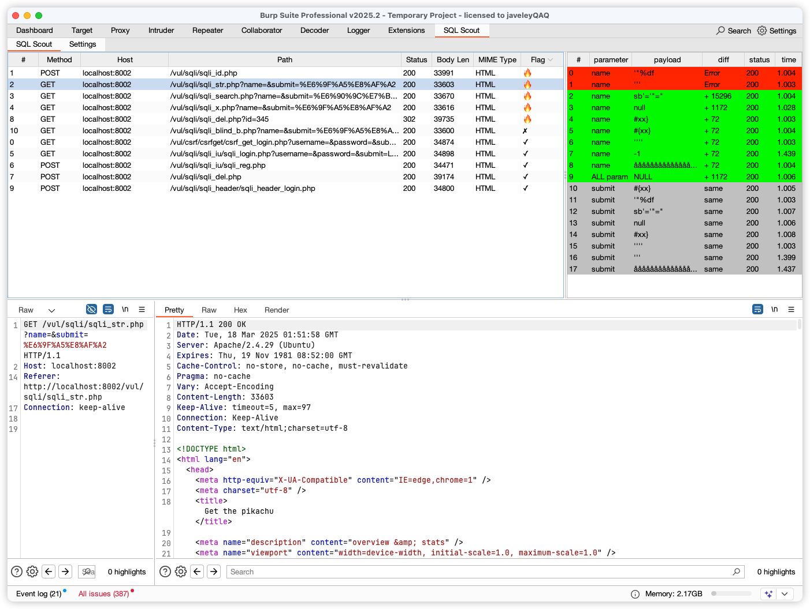

# SQL Injection Scout

SQL Injection Scout 是一个用于 Burp Suite 的扩展，专为帮助安全研究人员和开发人员检测和分析 SQL 注入漏洞而设计。该扩展提供了丰富的配置选项和直观的用户界面，便于用户自定义扫描和分析过程。

---

## 💯 功能特性

- **被动检测SQL**：支持对 `GET/POST` 请求的参数进行 `FUZZ` 测试，支持 `XML`、`JSON`、`FORM`表单数据格式。
- **最小化探测**：通过最小化的 `payload` 探测，减少对目标的影响。
- **响应差异分析**：对响应进行 `diff` 分析，自动标记无趣（灰色）和有趣（绿色）的响应。
    - **Interesting**：标记为值得进一步分析的响应。
    - **Boring**：标记为可以跳过的响应。
    - **判断原理**：假设页面参数为反射类型，通过比较 `payload` 和 `diff` 的长度，相同则认为无趣。
    - **重复内容过滤**：对绿色标记的分组进行进一步分析，出现`8`次以上重复的 `diff` 被标记为无趣。
    - **结果排序**：根据颜色对最终结果进行排序展示。
- **自动匹配**：在扫描页面的响应中自动匹配 `diff` 结果，默认取第一处的差异。
- **正则匹配**：正则匹配无需扫描的`URL`
- **内置范围**：支持内置的 `scope` 范围设置。
- **延时扫描**：支持固定抖动+随机抖动发包检测，更精准规避 `WAF`。
- **自定义扫描参数数量**：防止参数过多导致的性能问题或误报，默认`30`

## ✅️ 安装

1. 确保已安装 [Burp Suite](https://portswigger.net/burp)。
2. 下载或克隆此项目到本地:
   ```bash
   git clone  https://github.com/JaveleyQAQ/SQL-Injection-Scout.git
   ```
3. 使用 Gradle 构建项目：
   ```bash
   cd SQL-Injection-Scout
   ./gradlew build
   ```
4. 在 `Burp Suite` 中加载生成的 `JAR` 文件：
    - 打开 `Burp Suite`，导航到 `Extender` -> `Extensions`。
    - 点击 `Add` 按钮，选择生成的 `JAR` 文件（位于 `build/libs` 目录下）。

## 🥰  使用指南

1. 启动 Burp Suite 并确保 SQL Injection Scout 扩展已加载。
2. 在 `Extender` 选项卡中，找到 SQL Injection Scout 并打开其配置面板。
3. 根据需要调整参数和模式设置。
   
4. 使用 Burp Suite 的代理、扫描器等功能进行测试，SQL Injection Scout 将自动应用配置并提供结果。
   
## 🔖 待办事项
> 先画饼

- ~~**数据持久化：**~~  配置持久化✅ ｜ 数据持久化❌
- ~~**启发式检测**：支持自定义 response 的无趣匹配特征，无需再担心频繁误报。~~ ✅ 
- ~~**不安全的直接对象引用**：检测和报告不安全的直接对象引用。~~ ✅
- **diff 差异面板**：提供更详细的差异分析面板。
- **多处 diff 内容查看**：支持查看响应中多处差异。
- **颜色自定义**：允许用户自定义响应的颜色标记。
- **二次确认注入**：提供二次确认存在注入的条目。
- **性能优化**：进一步优化扫描性能，减少资源消耗。

---

####  [🔥 Update History](CHANGELOG.md)


## 联系

如有任何问题或建议，请通过 [JaveleyQAQ@outlook.com](mailto:your.email@example.com) 联系我。

## Start Hitory
